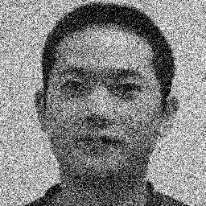
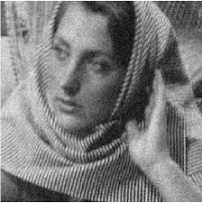

# global_vs_adaptive_thresholding

The input image taken is affected with Gaussian noise. The code firsts denoises the image using Gaussian filter and then performs the segmentation process using global thresholding technique and adaptive thresholding technique. A comparitive analysis of the output images between global and adaptive thresholding is given below. 

 
<h2>INPUT IMAGES AFFECTED BY GAUSSIAN NOISE</h2>

 

 

<h2>OUTPUT IMAGES</h2>

 
